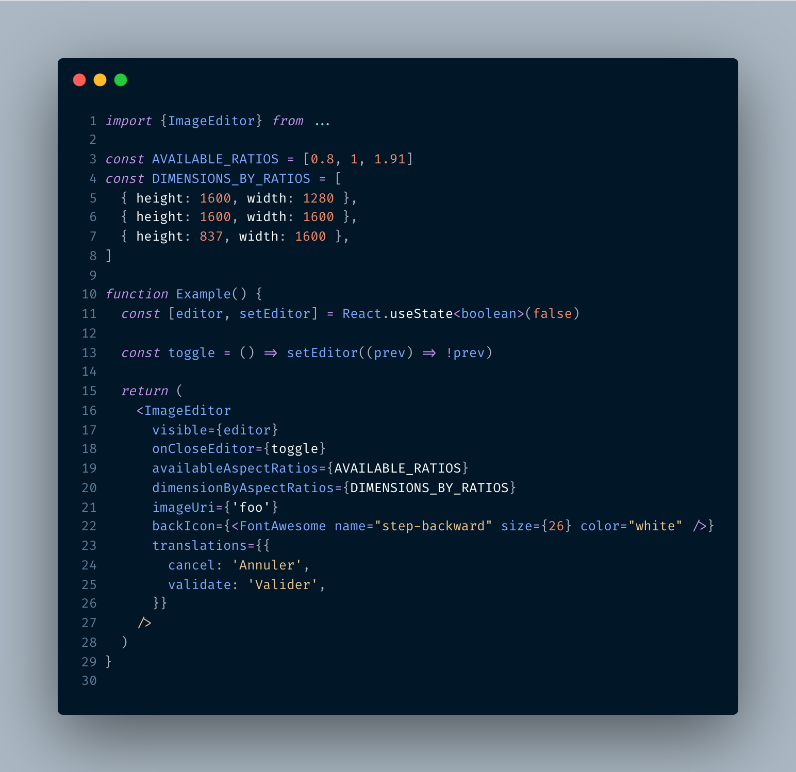

# 🌁 Expo Image Editor

A super simple image cropping and rotation tool for Expo that runs on iOS, Android and Web!

## Installation

To get started install the package in your Expo project by running:

```
yarn add @ko-platform/image-editor
```

or

```
npm i @ko-platform/image-editor
```

## Usage

The package exports a single component `ImageEditor` that can be placed anywhere in your project. This renders a modal that then returns the editing result when it is dismissed.



### Props

| Name                        | Type                    | Details                                                                                                                                              
| --------------------------- | --------                | -------------------
| visible                     | boolean (**required**)  |                                                                                                                               
| imageUri                    | string  (**required**)  |
| onEditingComplete           | function (**required**) |
| onCloseEditor               | function (**required**) |
| backIcon                    | Element                 |
| doneIcon                    | Element                 |
| cropIcon                    | Element                 |
| rotateIcon                  | Element                 |
| rotateLeftIcon              | Element                 |
| rotateRightIcon             | Element                 |
| availableAspectRatios       | number[]                |
| dimensionByAspectRatios     | Array<{width: number, height: number}> | Have to match with `availbaleAspectRatios` order
| lockAspectRatio             | boolean                 |
| translations                | object                  | Available translations: `{ cancel, validate }`

